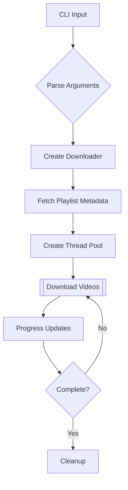

Here's a professional, well-structured README.md for your GitHub repository:

```markdown
# YouTube Playlist Downloader 🎥➡️📁

[![Python 3.9+]](https://img.shields.io/badge/python-3.9+-blue.svg)](https://www.python.org/downloads/)
[](https://opensource.org/licenses/MIT)
[](https://pypi.org/project/pytube/)

A high-performance Python utility for downloading YouTube playlists with parallel downloads and quality selection. Perfect for content archivists, educators, and media enthusiasts.

## Key Features ✨

- ⚡ **Parallel Downloads** - Multi-threaded downloads with configurable workers
- 📊 **Visual Progress** - Rich terminal interface with real-time progress tracking
- 🎚️ **Quality Control** - Preset resolutions from 144p to 1080p
- 🔊 **Audio Extraction** - MP4 audio-only download option
- 🛡️ **Error Resilient** - Automatic retries and skip existing files
- 📁 **Smart Organization** - Structured output with metadata preservation

## Installation 🛠️

1. **Clone Repository**
```bash
git clone https://github.com/yourusername/youtube-playlist-downloader.git
cd youtube-playlist-downloader
```

2. **Install Dependencies**
```bash
pip install -r requirements.txt
```

## Usage 🚀

### Basic Usage
```bash
python yt_downloader.py "https://youtube.com/playlist?list=PL..." --output ./videos
```

### Download Audio Only
```bash
python yt_downloader.py "PLAYLIST_URL" --audio --output ./podcasts
```

### High Quality Parallel Downloads
```bash
python yt_downloader.py "PLAYLIST_URL" --quality 1080p --jobs 6
```

### Full Help Menu
```bash
python yt_downloader.py --help
```

## Technical Implementation 💻

### Core Technologies
- **Python 3.9+** - Type hinted codebase
- **pytube** - YouTube content retrieval
- **rich** - Terminal formatting and progress
- **concurrent.futures** - Parallel processing

### Architecture



## License 📄

This project is licensed under the MIT License - see the [LICENSE](LICENSE) file for details.

---

**Developed with ❤️ by [Khaled]**  
[](https://www.freelancer.com/u/k5602)
[](https://www.linkedin.com/in/khaled-mahmoud-b19210311/)
```
